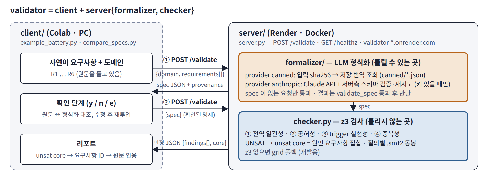

# validator

요구사항의 일관성(무모순성)과 실현 가능성을 검사하는 도구. 자연어 요구사항을 **formalizer**(LLM)가 형식 명세로 바꾸고, **checker**(z3)가 명세 사이의 모순·공허·중복을 검사한다. 예제 도메인: 전기차 배터리 충전 제어기.

```
validator/
├── client/                        # 자연어를 들고 서버를 부르는 쪽 — 표준 라이브러리만, LLM 호출 없음
│   ├── example_battery.py         #   요구사항 6개 → POST /validate(형식화) → 확인 → POST /validate(검사) → 원문 인용 리포트
│   ├── compare_specs.py           #   형식화 두 판을 구문·의미(SMT 동치)·감사결과로 비교
│   ├── specs/                     #   battery_spec.json(canned 판) · claude_spec.json(재변환 판)
│   └── requirements.txt           #   비어 있음
├── server/                        # Render 에 배포되는 쪽 — server.py = formalizer + checker
│   ├── server.py                  #   HTTP: POST /validate (/audit 별칭), GET /healthz
│   ├── formalizer/                #   자연어 → 명세 (LLM, 틀릴 수 있는 곳): canned · anthropic provider
│   ├── checker.py                 #   명세 → 판정 (z3, 틀리지 않는 곳): 감사 4종, unsat core
│   ├── tests/test_api.py · examples/ · Dockerfile · requirements.txt · README.md(API 문서)
├── render.yaml                    # Render Blueprint (service name: validator, rootDir: server)
├── validator_prototype.ipynb      # Colab 한 장: 구성 → 예제 → 부록
└── docs/                          # 구조도
```



**책임 경계.** 형식화(LLM)는 틀릴 수 있으므로 서버 `formalizer/`에 격리하고 결과에 provenance(provider·model·입력 해시)를 남긴다. 판정(z3)은 틀리지 않으므로 `checker.py`가 unsat core를 요구사항 ID로 돌려주고, 클라이언트가 그 ID를 원문 문장으로 되돌려 인용한다. 클라이언트는 형식화 결과를 사람이 확인하는 자리(y/n/e)를 갖는다.

## 빠른 시작

```bash
# 서버 (로컬)
cd server && pip install z3-solver && python server.py          # http://localhost:8000
python tests/test_api.py http://localhost:8000                  # PASS 확인

# 클라이언트
cd client
python example_battery.py --validator http://localhost:8000     # 형식화 → 확인(y/n/e) → 검사 → 리포트
python example_battery.py --yes --out out/                      # 확인 자동 통과, 결과 저장
python example_battery.py --one-shot                            # 1회 호출
python example_battery.py --spec specs/battery_spec.json        # 검사만
python compare_specs.py specs/battery_spec.json specs/claude_spec.json
```

배포된 서버 주소는 `--validator URL` 또는 환경변수 `VALIDATOR_URL`. 기본값은 현재 배포된 `https://validator-c6wn.onrender.com` — 서버를 옮기면 두 클라이언트의 기본값만 바꾸면 된다.

## API 요약 (전체는 `server/README.md`)

| 요청 | 응답 |
|---|---|
| `GET /healthz` | `{"ok", "checker": {"backend", "z3"}, "formalizer": {"providers", "canned"}}` |
| `POST /validate` 자연어 `{logic, domain, requirements[{id,text}], provider, formalize_only?}` | `{"status": "checked", "spec", "provenance", "result"}` / `formalize_only` 면 `{"status": "awaiting_confirmation", "spec", "provenance"}` |
| `POST /validate` 명세 `{spec}` | `{"status": "checked", "result"}` |

`result.findings[].kind`: `global_conflict` · `conditional_conflict`(req, trigger, core) · `vacuous`(req) · `redundant`(req, implied_by).

## 배포 (Render, 무료)

GitHub 저장소로 push → render.com "New → Blueprint" → 저장소 선택(`render.yaml` 자동 인식, 서비스명 `validator`) → 빌드 2~5분 → `/healthz` 확인. 현재 배포된 주소는 `https://validator-c6wn.onrender.com` 이다. `anthropic` provider 를 켜려면 대시보드 Environment 에 `ANTHROPIC_API_KEY` 추가. 무료 인스턴스는 15분 미사용 시 절전(첫 호출 ~1분), URL 공개·인증 없음 — 실제 대외비 명세는 사내 Docker 로.

## 예제 요구사항과 기대 결과

도메인: 온도 −20~80 °C, 전류 0~50 A, 급속(fast) 모드 Bool.

| ID | 요구사항 | 형식화 | 판정 |
|---|---|---|---|
| R1 | 온도 45 °C 초과 → 전류 10 A 이하 | `(=> (> temp 45) (<= current 10))` | |
| R2 | 급속 모드 → 전류 30 A 이상 유지 | `(=> fast (>= current 30))` | |
| R3 | 온도 50 °C 이상 → 급속 모드 전환 | `(=> (>= temp 50) fast)` | **조건부 모순** — 온도 ≥ 50 에서 R1·R2·R3 충돌 |
| R4 | 어떤 경우에도 32 A 초과 금지 | `(<= current 32)` | |
| R5 | 온도 60 °C 이상 → 전류 20 A 이하 | `(=> (>= temp 60) (<= current 20))` | **조건부 모순**(R2·R3·R5) + **중복**(R1 이 함의) |
| R6 | 온도 −30 °C 미만 → 급속 모드 전환 | `(=> (< temp (- 30)) fast)` | **공허** — trigger 가 센서 범위 밖 |

전역 일관성은 SAT — 전역 검사만으로는 문제가 보이지 않는다는 점이 이 예제의 요지.

## 다음 단계

`claude/validator-design.md`(설계-01): LTL 요구사항(`logic: ltl`), 왕복 검증(형식 → 자연어 → 형식, checker 동치), rt-inconsistency. 이 저장소는 그 설계의 (1) "저장소 통합·개명, SMT 회귀 통과" 단계까지 반영한 상태.
