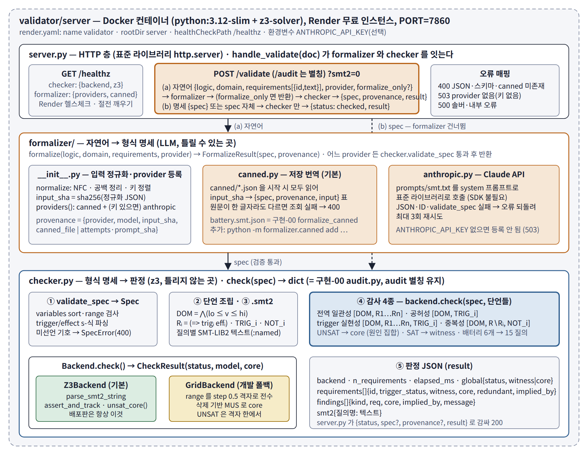

# validator/server — 요구사항 모순 검사 API (formalizer + checker)
`server.py` 가 두 모듈을 묶는다 — `formalizer/`(자연어 → 명세, LLM, 틀릴 수 있는 곳)와 `checker.py`(명세 → 판정, z3, 틀리지 않는 곳).
의존성은 z3 하나. `ANTHROPIC_API_KEY` 가 있으면 `anthropic` provider 가 켜지고, 없으면 저장 번역(`canned`)만 쓴다. 클라이언트는 어떤 언어로든 HTTP POST 로 쓴다.

```
GET  /healthz          → {"ok": true, "checker": {"backend": "z3 5.1.0", "z3": true}, "formalizer": {"providers": ["canned"], "canned": ["battery.smt"]}}
POST /validate         ← (a) 자연어 {logic, domain, requirements[{id,text}], provider, formalize_only?}
                          → {"status": "checked", "spec", "provenance", "result"}  |  formalize_only → {"status": "awaiting_confirmation", "spec", "provenance"}
                       ← (b) 명세 {"spec": {...}} 또는 spec 자체
                          → {"status": "checked", "result"}
                       ?smt2=0 이면 result.smt2 생략.  POST /audit 는 같은 핸들러의 별칭(구현-00 호환).
GET  /                 → 도움말 (텍스트)
```

**provider.** `canned`(기본): 도메인 문장 + 요구사항 원문을 정규화한 sha256 으로 `formalizer/canned/*.json` 의 저장 번역을 찾는다. 원문이 한 글자라도 다르면 400 `no canned translation` + `input_sha`. `anthropic`: Claude API 호출, 서버가 `checker.validate_spec` 으로 검증해 실패 시 오류를 되돌려 최대 3회 재시도. 키가 없으면 503.
**provenance.** `{provider, model, input_sha, canned_file | attempts·prompt_sha}` — 어느 번역이 어디서 왔는지 항상 남는다.

## 0. 구조

전체 흐름은 저장소 루트 README 의 그림. 서버 내부 — `server.py`(HTTP 층, `handle_validate`) → `formalizer/`(자연어 모드일 때) → `checker.py`(명세 검증 → 단언 조립 → 감사 4종 → 판정 JSON) → 백엔드(z3, 없으면 grid 폴백).



## 1. 입력 — 명세 JSON (spec 모드 · formalizer 의 출력 형식)

```json
{
  "logic": "smt",
  "variables": {
    "temp":    {"sort": "Real", "range": [-20, 80], "unit": "°C"},
    "current": {"sort": "Real", "range": [0, 50],  "unit": "A"},
    "fast":    {"sort": "Bool"}
  },
  "requirements": [
    {"id": "R1", "trigger": "(> temp 45)",     "effect": "(<= current 10)"},
    {"id": "R2", "trigger": "fast",            "effect": "(>= current 30)"},
    {"id": "R3", "trigger": "(>= temp 50)",    "effect": "fast"},
    {"id": "R4", "trigger": "true",            "effect": "(<= current 32)"},
    {"id": "R5", "trigger": "(>= temp 60)",    "effect": "(<= current 20)"},
    {"id": "R6", "trigger": "(< temp (- 30))", "effect": "fast"}
  ]
}
```

| 필드 | 규칙 |
|---|---|
| `logic` | 현재 `"smt"` 만. 생략 가능 |
| `variables.<name>.sort` | `Bool` · `Int` · `Real` |
| `variables.<name>.range` | 수치형 필수 `[lo, hi]` (도메인 제약 DOM 이 됨). `unit`, `meaning` 은 자유 |
| `requirements[].id` | 고유 문자열. `DOM` 은 예약어 |
| `requirements[].trigger` / `effect` | SMT-LIB Bool 식. 요구사항은 `(=> trigger effect)` 로 해석. 무조건 요구사항은 trigger `"true"` |
| 허용 연산자 | `and or not => xor ite = distinct < <= > >= + - * /` · 음수 리터럴 `(- 30)` |

스키마·문법 오류는 **HTTP 400** + `{"error": "spec error", "detail": "..."}`.

## 2. 출력 — 판정 JSON (`result`)

```json
{
  "logic": "smt", "backend": "z3 4.13.0", "n_requirements": 6, "elapsed_ms": 41.2,
  "global": {"status": "sat", "witness": {"temp": -20, "current": 0, "fast": false}, "core": []},
  "requirements": [
    {"id": "R1", "trigger_status": "realizable", "witness": {...}, "redundant": false, "distinguishing_witness": {...}},
    {"id": "R3", "trigger_status": "conflict",   "core": ["R1","R2","R3","TRIG_R3"], "redundant": false},
    {"id": "R5", "trigger_status": "conflict",   "core": [...], "redundant": true, "implied_by": ["R1"]},
    {"id": "R6", "trigger_status": "vacuous",    "core": ["DOM","TRIG_R6"], "redundant": false}
  ],
  "findings": [
    {"kind": "conditional_conflict", "req": "R3", "trigger": "(>= temp 50)", "core": ["R1","R2","R3"], "message": "..."},
    {"kind": "conditional_conflict", "req": "R5", "trigger": "(>= temp 60)", "core": ["R2","R3","R5"], "message": "..."},
    {"kind": "vacuous",   "req": "R6", "core": ["DOM","TRIG_R6"], "message": "..."},
    {"kind": "redundant", "req": "R5", "implied_by": ["R1"], "core": ["DOM","NOT_R5","R1"], "message": "..."}
  ],
  "smt2": {"global": "(set-option ...)", "trigger_R3": "...", "...": "..."}
}
```

| `findings[].kind` | 뜻 | 핵심 필드 |
|---|---|---|
| `global_conflict` | 모든 요구사항을 동시에 만족하는 상태가 없음 | `core` |
| `conditional_conflict` | `req` 의 trigger 상황에서 `core` 의 요구사항들을 동시에 지킬 수 없음 | `req`, `trigger`, `core` |
| `vacuous` | `req` 의 trigger 가 도메인 안에서 절대 참이 안 됨 — 발동하지 않는 요구사항 | `req` |
| `redundant` | `req` 는 `implied_by` (와 도메인)가 이미 함의 | `req`, `implied_by` |

`requirements[].trigger_status` ∈ `realizable` · `conflict` · `vacuous` · `unconditional`.
`core` 의 원소는 요구사항 ID 또는 `DOM`(도메인), `TRIG_<id>`(trigger 가정), `NOT_<id>`(중복성 검사의 부정). 클라이언트는 요구사항 ID 만 골라 원문 문장으로 되돌리면 된다.

감사 4종: ① 전역 일관성 sat(DOM ∧ ⋀R) ② 공허성 sat(DOM ∧ trigᵢ) ③ trigger 실현성 sat(DOM ∧ ⋀R ∧ trigᵢ) ④ 중복성 sat(DOM ∧ ⋀R∖Rᵢ ∧ ¬Rᵢ). UNSAT 이면 unsat core 가 원인 집합.

## 3. 호출 예

```bash
URL=https://validator-c6wn.onrender.com
curl -s $URL/healthz
curl -s -X POST "$URL/validate?smt2=0" -H "content-type: application/json" --data @examples/battery_input.json | python -m json.tool   # 자연어 모드
curl -s -X POST "$URL/validate?smt2=0" -H "content-type: application/json" --data "{\"spec\": $(cat examples/battery_spec.json)}"             # 명세 모드
```

```python
import json, urllib.request
spec = json.load(open("examples/battery_spec.json"))
req = urllib.request.Request(URL + "/validate?smt2=0", data=json.dumps({"spec": spec}).encode(),
                             headers={"content-type": "application/json"}, method="POST")
result = json.load(urllib.request.urlopen(req))["result"]
for f in result["findings"]:
    print(f["kind"], f.get("req"), f.get("core"), f.get("implied_by"))
```

통합 테스트: `python tests/test_api.py $URL` — spec 모드·자연어 모드(canned)·2단계·canned 미존재 400·잘못된 spec 400·`/audit` 별칭을 검사한다.

## 4. 실행·배포

```bash
python server.py                       # 로컬, http://localhost:8000 (PORT 환경변수로 변경). z3 없으면 grid 폴백
ANTHROPIC_API_KEY=sk-ant-... python server.py                   # anthropic provider 켜기
docker build -t validator . && docker run -p 8000:7860 validator
```

무료 호스팅 (2026-09 기준 각사 문서 확인):

| | 조건 | 판정 |
|---|---|---|
| **Render** | Docker 웹 서비스 무료 인스턴스, 카드 불필요, 월 750시간, 15분 미사용 시 절전(첫 요청 ~1분), URL 공개 | **적합 — 기본 선택.** `render.yaml` 포함 |
| Hugging Face Spaces | Docker/Gradio Space 는 **PRO(개인) 또는 Team(조직) 유료 플랜 필요** — 무료 계정은 Static Space 만 | 무료 조건에서 제외 |
| Vercel | Python 함수 500 MB·Hobby 300 s 라 z3 는 들어가지만 `server.py` 를 핸들러로 고쳐야 하고 Hobby 는 비상업 용도 제한 | 차선 |
| Cloudflare Workers | Pyodide(WASM) — z3 네이티브 확장 불가, 무료 CPU 10 ms/호출 | 부적합 |
| Fly.io | 신규 계정 무료 티어 없음(7일 체험 후 유료) | 무료 조건에서 제외 |

Render 절차: 저장소(validator) 루트를 GitHub 에 push → render.com "New → Blueprint" → 저장소 선택(루트의 `render.yaml`: name validator, rootDir server) → 2~5분 빌드 → `/healthz` 확인 → `python tests/test_api.py <URL>`. 현재 배포된 주소는 `https://validator-c6wn.onrender.com`.
실제 대외비 명세는 사내 Docker 권장 — 코드 동일.

## 5. 주의

- 응답의 `smt2` 는 질의별 SMT-LIB2 텍스트(재현용). 크기가 신경 쓰이면 `?smt2=0`.
- 백엔드가 `grid(...)` 로 나오면 z3 가 없는 환경 — SAT 판정은 건전하나 UNSAT 은 격자 해상도 한에서. 배포판은 항상 z3.
- 인증 없음. URL 을 아는 누구나 호출 가능. `anthropic` provider 를 켠 서버는 키가 서버에 있으므로 사내 인스턴스에서만.
